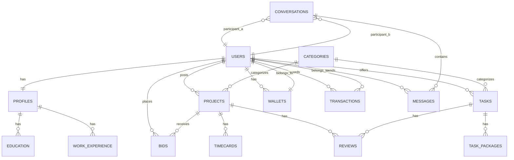

# Database Schema

**Database name:** `freelance_marketplace`

This document contains the database table definitions used by the API and a short description of their purpose. Add column-level schemas here as needed.
## Table of contents

- [Conventions](#conventions)
- [Schema SQL](#schema-sql)
	- [Users](#users)
	- [Profiles](#profiles)
	- [Education](#education)
	- [Work Experience](#work-experience)
	- [Categories](#categories)
	- [Projects](#projects)
	- [Tasks](#tasks)
	- [Task Packages](#task-packages)
	- [Bids](#bids)
	- [Conversations & Messages](#conversations--messages)
	- [Wallets & Transactions](#wallets--transactions)
	- [Timecards & Reviews](#timecards--reviews)
- [ER Diagram](#er-diagram)
- [Indexes & Migrations](#indexes--migrations)
- [Notes & Changelog](#notes--changelog)

## Conventions

- UUID columns use `CHAR(36)` to store RFC4122 strings (consider native UUID types when supported).
- Timestamps use `TIMESTAMP` and default to `CURRENT_TIMESTAMP` where applicable.
- JSON columns store arrays/objects for flexible lists (e.g., `languages`, `features_list`).
- Foreign keys assume parent primary keys exist; verify target column names (`profiles.id` vs `profiles.user_id`).

---

## Schema SQL

### Users

```sql
CREATE TABLE users (
	id CHAR(36) PRIMARY KEY,
	email VARCHAR(25) NOT NULL UNIQUE,
	password_hash VARCHAR(40) NOT NULL,
	role ENUM('freelancer','client','admin') NOT NULL DEFAULT 'freelancer',
	status ENUM('active','away','suspended') DEFAULT 'active',
	created_at TIMESTAMP DEFAULT CURRENT_TIMESTAMP,
	updated_at TIMESTAMP DEFAULT CURRENT_TIMESTAMP ON UPDATE CURRENT_TIMESTAMP,
	INDEX idx_email(email)
);
```

### Profiles

```sql
CREATE TABLE profiles (
	id CHAR(36) PRIMARY KEY,
	user_id CHAR(36) NOT NULL UNIQUE,
	first_name VARCHAR(15),
	last_name VARCHAR(15),
	avatar_url TEXT,
	location VARCHAR(25),
	freelancer_type VARCHAR(15),
	english_level ENUM('basic','conversational','fluent','native') DEFAULT 'conversational',
	hourly_rate DECIMAL(10,2) DEFAULT 0.00,
	hours_per_week INT DEFAULT 40,
	response_time VARCHAR(50),
	about TEXT,
	avg_rating DECIMAL(3,2) DEFAULT 0.00,
	total_reviews INT DEFAULT 0,
	happy_clients INT DEFAULT 0,
	projects_done INT DEFAULT 0,
	languages JSON,
	updated_at TIMESTAMP DEFAULT CURRENT_TIMESTAMP ON UPDATE CURRENT_TIMESTAMP,
	FOREIGN KEY (user_id) REFERENCES users(id) ON DELETE CASCADE
);
```

### Education

```sql
CREATE TABLE education (
	id CHAR(36) PRIMARY KEY,
	profile_id CHAR(36) NOT NULL,
	institution_name VARCHAR(35) NOT NULL,
	degree VARCHAR(25) NOT NULL,
	start_date DATE NOT NULL,
	end_date DATE,
	description TEXT,
	FOREIGN KEY (profile_id) REFERENCES profiles(user_id) ON DELETE CASCADE
);
```

### Work Experience

```sql
CREATE TABLE work_experience (
	id CHAR(36) PRIMARY KEY,
	profile_id CHAR(36) NOT NULL,
	company_name VARCHAR(35) NOT NULL,
	title VARCHAR(25) NOT NULL,
	location VARCHAR(25),
	start_date DATE NOT NULL,
	end_date DATE,
	description TEXT,
	FOREIGN KEY (profile_id) REFERENCES profiles(user_id) ON DELETE CASCADE
);
```

### Categories

```sql
CREATE TABLE categories (
	id INT AUTO_INCREMENT PRIMARY KEY,
	name VARCHAR(20) NOT NULL UNIQUE,
	slug VARCHAR(20) NOT NULL UNIQUE,
	icon_url TEXT
);
```

### Projects

```sql
CREATE TABLE projects (
	id CHAR(36) PRIMARY KEY,
	client_id CHAR(36) NOT NULL,
	category_id INT,
	title VARCHAR(55) NOT NULL,
	description TEXT NOT NULL,
	price_type ENUM('fixed','hourly') DEFAULT 'fixed',
	min_price DECIMAL(10,2),
	max_price DECIMAL(10,2),
	experience_level ENUM('entry','intermediate','senior') DEFAULT 'entry',
	job_type ENUM('remote','hybrid','on-site') DEFAULT 'remote',
	status ENUM('open','ongoing','completed','canceled') DEFAULT 'open',
	hiring_capacity INT DEFAULT 1,
	created_at TIMESTAMP DEFAULT CURRENT_TIMESTAMP,
	FOREIGN KEY (client_id) REFERENCES users(id),
	FOREIGN KEY (category_id) REFERENCES categories(id)
);
```

### Tasks

```sql
CREATE TABLE tasks (
	id CHAR(36) PRIMARY KEY,
	freelancer_id CHAR(36) NOT NULL,
	title VARCHAR(55) NOT NULL,
	description TEXT NOT NULL,
	cover_image_url TEXT,
	category_id INT,
	delivery_days INT DEFAULT 3,
	views_count INT DEFAULT 0,
	status ENUM('active','paused') DEFAULT 'active',
	created_at TIMESTAMP DEFAULT CURRENT_TIMESTAMP,
	FOREIGN KEY (freelancer_id) REFERENCES users(id),
	FOREIGN KEY (category_id) REFERENCES categories(id)
);
```

### Task Packages

```sql
CREATE TABLE task_packages (
	id CHAR(36) PRIMARY KEY,
	task_id CHAR(36) NOT NULL,
	service_type ENUM('basic','standard','premium') DEFAULT 'basic',
	price DECIMAL(10,2) NOT NULL,
	features_list JSON,
	FOREIGN KEY (task_id) REFERENCES tasks(id) ON DELETE CASCADE
);
```

### Bids

```sql
CREATE TABLE bids (
	id CHAR(36) PRIMARY KEY,
	project_id CHAR(36) NOT NULL,
	freelancer_id CHAR(36) NOT NULL,
	proposal_text TEXT,
	client_hourly_rate DECIMAL(10,2),
	freelancer_hourly_rate DECIMAL(10,2),
	status ENUM('pending','accepted','rejected') DEFAULT 'pending',
	created_at TIMESTAMP DEFAULT CURRENT_TIMESTAMP,
	FOREIGN KEY (project_id) REFERENCES projects(id) ON DELETE CASCADE,
	FOREIGN KEY (freelancer_id) REFERENCES users(id)
);
```

### Conversations & Messages

```sql
CREATE TABLE conversations (
	id CHAR(36) PRIMARY KEY,
	participant_a CHAR(36) NOT NULL,
	participant_b CHAR(36) NOT NULL,
	last_message_at TIMESTAMP DEFAULT CURRENT_TIMESTAMP,
	FOREIGN KEY (participant_a) REFERENCES users(id),
	FOREIGN KEY (participant_b) REFERENCES users(id)
);

CREATE TABLE messages (
	id CHAR(36) PRIMARY KEY,
	conversation_id CHAR(36) NOT NULL,
	sender_id CHAR(36) NOT NULL,
	message_body TEXT NOT NULL,
	is_read BOOLEAN DEFAULT FALSE,
	sent_at TIMESTAMP DEFAULT CURRENT_TIMESTAMP,
	FOREIGN KEY (conversation_id) REFERENCES conversations(id) ON DELETE CASCADE,
	FOREIGN KEY (sender_id) REFERENCES users(id)
);
```

### Wallets & Transactions

```sql
CREATE TABLE wallets (
	user_id CHAR(36) PRIMARY KEY,
	balance_available DECIMAL(10,2) DEFAULT 0.00,
	balance_pending DECIMAL(10,2) DEFAULT 0.00,
	total_withdrawn DECIMAL(10,2) DEFAULT 0.00,
	updated_at TIMESTAMP DEFAULT CURRENT_TIMESTAMP ON UPDATE CURRENT_TIMESTAMP,
	FOREIGN KEY (user_id) REFERENCES users(id) ON DELETE CASCADE
);

CREATE TABLE transactions (
	id CHAR(36) PRIMARY KEY,
	user_id CHAR(36) NOT NULL,
	amount DECIMAL(10,2) NOT NULL,
	type ENUM('income','withdrawal','escrow') NOT NULL,
	status ENUM('pending','completed','failed') DEFAULT 'pending',
	created_at TIMESTAMP DEFAULT CURRENT_TIMESTAMP,
	FOREIGN KEY (user_id) REFERENCES users(id)
);
```

### Timecards & Reviews

```sql
CREATE TABLE timecards (
	id CHAR(36) PRIMARY KEY,
	project_id CHAR(36) NOT NULL,
	freelancer_id CHAR(36) NOT NULL,
	worked_date DATE NOT NULL,
	hours DECIMAL(4,2) NOT NULL,
	description TEXT,
	status ENUM('pending','paid','disputed') DEFAULT 'pending',
	FOREIGN KEY (project_id) REFERENCES projects(id),
	FOREIGN KEY (freelancer_id) REFERENCES users(id)
);

CREATE TABLE reviews (
	id CHAR(36) PRIMARY KEY,
	reviewer_id CHAR(36) NOT NULL,
	reviewee_id CHAR(36) NOT NULL,
	project_id CHAR(36) DEFAULT NULL,
	task_id CHAR(36) DEFAULT NULL,
	rating INT CHECK (rating >= 1 AND rating <= 5),
	comment TEXT,
	created_at TIMESTAMP DEFAULT CURRENT_TIMESTAMP,
	FOREIGN KEY (reviewer_id) REFERENCES users(id),
	FOREIGN KEY (reviewee_id) REFERENCES users(id)
);
```

---

## ER Diagram

Below is a Mermaid ER diagram illustrating the primary relationships between tables.



---

## Indexes & Migrations

- Add indexes on frequently queried columns (e.g., `email`, `created_at`, foreign keys).
- When creating migrations, consider using the ORM/migration tool's UUID helper instead of `CHAR(36)`.
- Verify `FOREIGN KEY` targets: some source SQL references `profiles(user_id)` — confirm you want to reference `profiles.id` or `profiles.user_id`.

## Notes & Changelog

- 2026-06-09: Extracted full SQL and added Mermaid ER diagram.
- Next: generate ORM migrations or sample `CREATE TABLE` scripts per DB engine.
# Database Schema

**Database name:** `freelance_marketplace`

This document contains the database tables referenced by the API and a short description of their purpose. Add column-level schemas here as needed.

### Tables used by the API

| Table | Purpose |
|-------|---------|
| `users` | Authentication and account records |
| `profiles` | User profile data (names, avatar_url, freelancer_type, etc.) |
| `wallets` | User wallet balances and account totals |
| `transactions` | Financial transactions and earning history |
| `projects` | Project listings and metadata |
| `bids` | Bids placed on projects |
| `tasks` | Task listings and task-related data |
| `categories` | Service and project categories |
| `conversations` | Chat threads between users |
| `messages` | Messages within conversations |
| `reviews` | User reviews and ratings |
| `saved_items` | Bookmarked projects or tasks |
| `task_packages` | Pricing tiers for tasks |
| `timecards` | Work time tracking for projects |
| `education` | Profile education history |
| `work_experience` | Profile work experience history |

**Notes & next steps**

- Expand this file with column definitions and sample CREATE TABLE statements if desired.
- If you use a migration tool (e.g., Knex, Sequelize, or TypeORM), include schema source references here.

---

# Database Schema

**Database name:** `freelance_marketplace`

This document contains the database table definitions used by the API. The SQL below is the canonical schema reference — use it as a starting point for migrations or ORMs.

---

## `users`

```sql
CREATE TABLE users (
	id CHAR(36) PRIMARY KEY,
	email VARCHAR(25) NOT NULL UNIQUE,
	password_hash VARCHAR(40) NOT NULL,
	role ENUM('freelancer', 'client', 'admin') NOT NULL DEFAULT 'freelancer',
	status ENUM('active', 'away', 'suspended') DEFAULT 'active',
	created_at TIMESTAMP DEFAULT CURRENT_TIMESTAMP,
	updated_at TIMESTAMP DEFAULT CURRENT_TIMESTAMP ON UPDATE CURRENT_TIMESTAMP,
	INDEX idx_email(email)
);
```

## `profiles`

```sql
CREATE TABLE profiles (
	id CHAR(36) PRIMARY KEY,
	user_id CHAR(36) NOT NULL UNIQUE,
	first_name VARCHAR(15),
	last_name VARCHAR(15),
	avatar_url TEXT,
	location VARCHAR(25),
	freelancer_type VARCHAR(15),
	english_level ENUM('basic', 'conversational', 'fluent', 'native') DEFAULT 'conversational',
	hourly_rate DECIMAL(10, 2) DEFAULT 0.00,
	hours_per_week INT DEFAULT 40,
	response_time VARCHAR(50),
	about TEXT,
	avg_rating DECIMAL(3, 2) DEFAULT 0.00,
	total_reviews INT DEFAULT 0,
	happy_clients INT DEFAULT 0,
	projects_done INT DEFAULT 0,
	languages JSON,
	updated_at TIMESTAMP DEFAULT CURRENT_TIMESTAMP ON UPDATE CURRENT_TIMESTAMP,
	FOREIGN KEY (user_id) REFERENCES users(id) ON DELETE CASCADE
);
```

## `education`

```sql
CREATE TABLE education (
	id CHAR(36) PRIMARY KEY,
	profile_id CHAR(36) NOT NULL,
	institution_name VARCHAR(35) NOT NULL,
	degree VARCHAR(25) NOT NULL,
	start_date DATE NOT NULL,
	end_date DATE,
	description TEXT,
	FOREIGN KEY (profile_id) REFERENCES profiles(user_id) ON DELETE CASCADE
);
```

## `work_experience`

```sql
CREATE TABLE work_experience (
	id CHAR(36) PRIMARY KEY,
	profile_id CHAR(36) NOT NULL,
	company_name VARCHAR(35) NOT NULL,
	title VARCHAR(25) NOT NULL,
	location VARCHAR(25),
	start_date DATE NOT NULL,
	end_date DATE,
	description TEXT,
	FOREIGN KEY (profile_id) REFERENCES profiles(user_id) ON DELETE CASCADE
);
```

## `categories`

```sql
CREATE TABLE categories (
	id INT AUTO_INCREMENT PRIMARY KEY,
	name VARCHAR(20) NOT NULL UNIQUE,
	slug VARCHAR(20) NOT NULL UNIQUE,
	icon_url TEXT
);
```

## `projects`

```sql
CREATE TABLE projects (
	id CHAR(36) PRIMARY KEY,
	client_id CHAR(36) NOT NULL,
	category_id INT,
	title VARCHAR(55) NOT NULL,
	description TEXT NOT NULL,
	price_type ENUM('fixed', 'hourly') DEFAULT 'fixed',
	min_price DECIMAL(10, 2),
	max_price DECIMAL(10, 2),
	experience_level ENUM('entry', 'intermediate', 'senior') DEFAULT 'entry',
	job_type ENUM('remote', 'hybrid', 'on-site') DEFAULT 'remote',
	status ENUM('open', 'ongoing', 'completed', 'canceled') DEFAULT 'open',
	hiring_capacity INT DEFAULT 1,
	created_at TIMESTAMP DEFAULT CURRENT_TIMESTAMP,
	FOREIGN KEY (client_id) REFERENCES users(id),
	FOREIGN KEY (category_id) REFERENCES categories(id)
);
```

## `tasks`

```sql
CREATE TABLE tasks (
	id CHAR(36) PRIMARY KEY,
	freelancer_id CHAR(36) NOT NULL,
	title VARCHAR(55) NOT NULL,
	description TEXT NOT NULL,
	cover_image_url TEXT,
	category_id INT,
	delivery_days INT DEFAULT 3,
	views_count INT DEFAULT 0,
	status ENUM('active', 'paused') DEFAULT 'active',
	created_at TIMESTAMP DEFAULT CURRENT_TIMESTAMP,
	FOREIGN KEY (freelancer_id) REFERENCES users(id),
	FOREIGN KEY (category_id) REFERENCES categories(id)
);
```

## `task_packages`

```sql
CREATE TABLE task_packages (
	id CHAR(36) PRIMARY KEY,
	task_id CHAR(36) NOT NULL,
	service_type ENUM('basic', 'standard', 'premium') DEFAULT 'basic',
	price DECIMAL(10, 2) NOT NULL,
	features_list JSON,
	FOREIGN KEY (task_id) REFERENCES tasks(id) ON DELETE CASCADE
);
```

## `bids`

```sql
CREATE TABLE bids (
	id CHAR(36) PRIMARY KEY,
	project_id CHAR(36) NOT NULL,
	freelancer_id CHAR(36) NOT NULL,
	proposal_text TEXT,
	client_hourly_rate DECIMAL(10, 2),
	freelancer_hourly_rate DECIMAL(10, 2),
	status ENUM('pending', 'accepted', 'rejected') DEFAULT 'pending',
	created_at TIMESTAMP DEFAULT CURRENT_TIMESTAMP,
	FOREIGN KEY (project_id) REFERENCES projects(id) ON DELETE CASCADE,
	FOREIGN KEY (freelancer_id) REFERENCES users(id)
);
```

## `conversations` and `messages`

```sql
CREATE TABLE conversations (
	id CHAR(36) PRIMARY KEY,
	participant_a CHAR(36) NOT NULL,
	participant_b CHAR(36) NOT NULL,
	last_message_at TIMESTAMP DEFAULT CURRENT_TIMESTAMP,
	FOREIGN KEY (participant_a) REFERENCES users(id),
	FOREIGN KEY (participant_b) REFERENCES users(id)
);

CREATE TABLE messages (
	id CHAR(36) PRIMARY KEY,
	conversation_id CHAR(36) NOT NULL,
	sender_id CHAR(36) NOT NULL,
	message_body TEXT NOT NULL,
	is_read BOOLEAN DEFAULT FALSE,
	sent_at TIMESTAMP DEFAULT CURRENT_TIMESTAMP,
	FOREIGN KEY (conversation_id) REFERENCES conversations(id) ON DELETE CASCADE,
	FOREIGN KEY (sender_id) REFERENCES users(id)
);
```

## `wallets` and `transactions`

```sql
CREATE TABLE wallets (
	user_id CHAR(36) PRIMARY KEY,
	balance_available DECIMAL(10, 2) DEFAULT 0.00,
	balance_pending DECIMAL(10, 2) DEFAULT 0.00,
	total_withdrawn DECIMAL(10, 2) DEFAULT 0.00,
	updated_at TIMESTAMP DEFAULT CURRENT_TIMESTAMP ON UPDATE CURRENT_TIMESTAMP,
	FOREIGN KEY (user_id) REFERENCES users(id) ON DELETE CASCADE
);

CREATE TABLE transactions (
	id CHAR(36) PRIMARY KEY,
	user_id CHAR(36) NOT NULL,
	amount DECIMAL(10, 2) NOT NULL,
	type ENUM('income', 'withdrawal', 'escrow') NOT NULL,
	status ENUM('pending', 'completed', 'failed') DEFAULT 'pending',
	created_at TIMESTAMP DEFAULT CURRENT_TIMESTAMP,
	FOREIGN KEY (user_id) REFERENCES users(id)
);
```

## `timecards` and `reviews`

```sql
CREATE TABLE timecards (
	id CHAR(36) PRIMARY KEY,
	project_id CHAR(36) NOT NULL,
	freelancer_id CHAR(36) NOT NULL,
	worked_date DATE NOT NULL,
	hours DECIMAL(4, 2) NOT NULL,
	description TEXT,
	status ENUM('pending', 'paid', 'disputed') DEFAULT 'pending',
	FOREIGN KEY (project_id) REFERENCES projects(id),
	FOREIGN KEY (freelancer_id) REFERENCES users(id)
);

CREATE TABLE reviews (
	id CHAR(36) PRIMARY KEY,
	reviewer_id CHAR(36) NOT NULL,
	reviewee_id CHAR(36) NOT NULL,
	project_id CHAR(36) DEFAULT NULL,
	task_id CHAR(36) DEFAULT NULL,
	rating INT CHECK (rating >= 1 AND rating <= 5),
	comment TEXT,
	created_at TIMESTAMP DEFAULT CURRENT_TIMESTAMP,
	FOREIGN KEY (reviewer_id) REFERENCES users(id),
	FOREIGN KEY (reviewee_id) REFERENCES users(id)
);
```

---

Notes:

- Some `FOREIGN KEY` clauses reference `profiles(user_id)` in the source SQL; when generating migrations, ensure the FK targets the correct column (`profiles.id` vs `profiles.user_id`) depending on your design.
- Consider using `CHAR(36)` for UUIDs or native UUID types if your DB supports them.
- Add indexes on frequently queried columns (email, created_at, status, foreign keys) as needed.

## ER Diagram

Below is a Mermaid ER diagram illustrating the primary relationships between tables.


