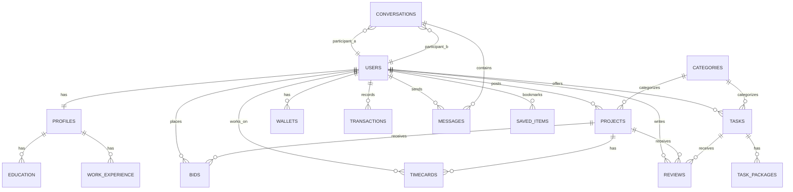

# Database Schema

**Database name:** `freelance_marketplace`  
**Last Updated:** 2026-06-12  
**Foreign Key Strategy:** `ON UPDATE CASCADE` with selective `ON DELETE CASCADE` / `ON DELETE NO ACTION`

This document contains the final database schema used by the FreelancerHub API.

---

## Table of Contents

- [Conventions](#conventions)
- [Schema](#schema)
  - [Users](#users)
  - [Profiles](#profiles)
  - [Education](#education)
  - [Work Experience](#work-experience)
  - [Categories](#categories)
  - [Projects](#projects)
  - [Tasks](#tasks)
  - [Task Packages](#task-packages)
  - [Bids](#bids)
  - [Conversations](#conversations)
  - [Messages](#messages)
  - [Wallets](#wallets)
  - [Transactions](#transactions)
  - [Timecards](#timecards)
  - [Reviews](#reviews)
  - [Saved Items](#saved-items)
- [Foreign Key Reference](#foreign-key-reference)
- [ER Diagram](#er-diagram)
- [Indexes](#indexes)
- [Changelog](#changelog)

---

## Conventions

- UUIDs are stored as `CHAR(36)`.
- Timestamps use `TIMESTAMP` with `CURRENT_TIMESTAMP` defaults where appropriate.
- JSON columns store flexible arrays or objects.
- Every foreign key in this schema updates with `ON UPDATE CASCADE`.
- Delete behavior is chosen per relationship based on the live database output.

---

## Schema

### Users

```sql
CREATE TABLE users (
  id CHAR(36) PRIMARY KEY,
  email VARCHAR(25) NOT NULL UNIQUE,
  password_hash VARCHAR(40) NOT NULL,
  role ENUM('freelancer','client','admin') NOT NULL DEFAULT 'freelancer',
  status ENUM('active','away','suspended') DEFAULT 'active',
  created_at TIMESTAMP DEFAULT CURRENT_TIMESTAMP,
  updated_at TIMESTAMP DEFAULT CURRENT_TIMESTAMP ON UPDATE CURRENT_TIMESTAMP,
  INDEX idx_email(email)
);
```

### Profiles

```sql
CREATE TABLE profiles (
  id CHAR(36) PRIMARY KEY,
  user_id CHAR(36) NOT NULL UNIQUE,
  first_name VARCHAR(15),
  last_name VARCHAR(15),
  avatar_url TEXT,
  location VARCHAR(25),
  freelancer_type VARCHAR(15),
  english_level ENUM('basic','conversational','fluent','native') DEFAULT 'conversational',
  hourly_rate DECIMAL(10,2) DEFAULT 0.00,
  hours_per_week INT DEFAULT 40,
  response_time VARCHAR(50),
  about TEXT,
  avg_rating DECIMAL(3,2) DEFAULT 0.00,
  total_reviews INT DEFAULT 0,
  happy_clients INT DEFAULT 0,
  projects_done INT DEFAULT 0,
  languages JSON,
  updated_at TIMESTAMP DEFAULT CURRENT_TIMESTAMP ON UPDATE CURRENT_TIMESTAMP,
  FOREIGN KEY (user_id) REFERENCES users(id) ON UPDATE CASCADE ON DELETE CASCADE
);
```

### Education

```sql
CREATE TABLE education (
  id CHAR(36) PRIMARY KEY,
  profile_id CHAR(36) NOT NULL,
  institution_name VARCHAR(35) NOT NULL,
  degree VARCHAR(25) NOT NULL,
  start_date DATE NOT NULL,
  end_date DATE,
  description TEXT,
  FOREIGN KEY (profile_id) REFERENCES profiles(id) ON UPDATE CASCADE ON DELETE CASCADE
);
```

### Work Experience

```sql
CREATE TABLE work_experience (
  id CHAR(36) PRIMARY KEY,
  profile_id CHAR(36) NOT NULL,
  company_name VARCHAR(35) NOT NULL,
  title VARCHAR(25) NOT NULL,
  location VARCHAR(25),
  start_date DATE NOT NULL,
  end_date DATE,
  description TEXT,
  FOREIGN KEY (profile_id) REFERENCES profiles(id) ON UPDATE CASCADE ON DELETE CASCADE
);
```

### Categories

```sql
CREATE TABLE categories (
  id INT AUTO_INCREMENT PRIMARY KEY,
  name VARCHAR(20) NOT NULL UNIQUE,
  slug VARCHAR(20) NOT NULL UNIQUE,
  icon_url TEXT
);
```

### Projects

```sql
CREATE TABLE projects (
  id CHAR(36) PRIMARY KEY,
  client_id CHAR(36) NOT NULL,
  category_id INT,
  title VARCHAR(55) NOT NULL,
  description TEXT NOT NULL,
  price_type ENUM('fixed','hourly') DEFAULT 'fixed',
  min_price DECIMAL(10,2),
  max_price DECIMAL(10,2),
  experience_level ENUM('entry','intermediate','senior') DEFAULT 'entry',
  job_type ENUM('remote','hybrid','on-site') DEFAULT 'remote',
  status ENUM('open','ongoing','completed','canceled') DEFAULT 'open',
  hiring_capacity INT DEFAULT 1,
  created_at TIMESTAMP DEFAULT CURRENT_TIMESTAMP,
  FOREIGN KEY (client_id) REFERENCES users(id) ON UPDATE CASCADE ON DELETE NO ACTION,
  FOREIGN KEY (category_id) REFERENCES categories(id) ON UPDATE CASCADE ON DELETE NO ACTION
);
```

### Tasks

```sql
CREATE TABLE tasks (
  id CHAR(36) PRIMARY KEY,
  freelancer_id CHAR(36) NOT NULL,
  title VARCHAR(55) NOT NULL,
  description TEXT NOT NULL,
  cover_image_url TEXT,
  category_id INT,
  delivery_days INT DEFAULT 3,
  views_count INT DEFAULT 0,
  status ENUM('active','paused') DEFAULT 'active',
  created_at TIMESTAMP DEFAULT CURRENT_TIMESTAMP,
  FOREIGN KEY (freelancer_id) REFERENCES users(id) ON UPDATE CASCADE ON DELETE NO ACTION,
  FOREIGN KEY (category_id) REFERENCES categories(id) ON UPDATE CASCADE ON DELETE NO ACTION
);
```

### Task Packages

```sql
CREATE TABLE task_packages (
  id CHAR(36) PRIMARY KEY,
  task_id CHAR(36) NOT NULL,
  service_type ENUM('basic','standard','premium') DEFAULT 'basic',
  price DECIMAL(10,2) NOT NULL,
  features_list JSON,
  FOREIGN KEY (task_id) REFERENCES tasks(id) ON UPDATE CASCADE ON DELETE CASCADE
);
```

### Bids

```sql
CREATE TABLE bids (
  id CHAR(36) PRIMARY KEY,
  project_id CHAR(36) NOT NULL,
  freelancer_id CHAR(36) NOT NULL,
  proposal_text TEXT,
  client_hourly_rate DECIMAL(10,2),
  freelancer_hourly_rate DECIMAL(10,2),
  status ENUM('pending','accepted','rejected') DEFAULT 'pending',
  created_at TIMESTAMP DEFAULT CURRENT_TIMESTAMP,
  FOREIGN KEY (project_id) REFERENCES projects(id) ON UPDATE CASCADE ON DELETE CASCADE,
  FOREIGN KEY (freelancer_id) REFERENCES users(id) ON UPDATE CASCADE ON DELETE NO ACTION
);
```

### Conversations

```sql
CREATE TABLE conversations (
  id CHAR(36) PRIMARY KEY,
  participant_a CHAR(36) NOT NULL,
  participant_b CHAR(36) NOT NULL,
  last_message_at TIMESTAMP DEFAULT CURRENT_TIMESTAMP,
  FOREIGN KEY (participant_a) REFERENCES users(id) ON UPDATE CASCADE ON DELETE NO ACTION,
  FOREIGN KEY (participant_b) REFERENCES users(id) ON UPDATE CASCADE ON DELETE NO ACTION
);
```

### Messages

```sql
CREATE TABLE messages (
  id CHAR(36) PRIMARY KEY,
  conversation_id CHAR(36) NOT NULL,
  sender_id CHAR(36) NOT NULL,
  message_body TEXT NOT NULL,
  is_read BOOLEAN DEFAULT FALSE,
  sent_at TIMESTAMP DEFAULT CURRENT_TIMESTAMP,
  FOREIGN KEY (conversation_id) REFERENCES conversations(id) ON UPDATE CASCADE ON DELETE CASCADE,
  FOREIGN KEY (sender_id) REFERENCES users(id) ON UPDATE CASCADE ON DELETE NO ACTION
);
```

### Wallets

```sql
CREATE TABLE wallets (
  user_id CHAR(36) PRIMARY KEY,
  balance_available DECIMAL(10,2) DEFAULT 0.00,
  balance_pending DECIMAL(10,2) DEFAULT 0.00,
  total_withdrawn DECIMAL(10,2) DEFAULT 0.00,
  updated_at TIMESTAMP DEFAULT CURRENT_TIMESTAMP ON UPDATE CURRENT_TIMESTAMP,
  FOREIGN KEY (user_id) REFERENCES users(id) ON UPDATE CASCADE ON DELETE CASCADE
);
```

### Transactions

```sql
CREATE TABLE transactions (
  id CHAR(36) PRIMARY KEY,
  user_id CHAR(36) NOT NULL,
  amount DECIMAL(10,2) NOT NULL,
  type ENUM('income','withdrawal','escrow') NOT NULL,
  status ENUM('pending','completed','failed') DEFAULT 'pending',
  created_at TIMESTAMP DEFAULT CURRENT_TIMESTAMP,
  FOREIGN KEY (user_id) REFERENCES users(id) ON UPDATE CASCADE ON DELETE NO ACTION
);
```

### Timecards

```sql
CREATE TABLE timecards (
  id CHAR(36) PRIMARY KEY,
  project_id CHAR(36) NOT NULL,
  freelancer_id CHAR(36) NOT NULL,
  worked_date DATE NOT NULL,
  hours DECIMAL(4,2) NOT NULL,
  description TEXT,
  status ENUM('pending','paid','disputed') DEFAULT 'pending',
  FOREIGN KEY (project_id) REFERENCES projects(id) ON UPDATE CASCADE ON DELETE NO ACTION,
  FOREIGN KEY (freelancer_id) REFERENCES users(id) ON UPDATE CASCADE ON DELETE NO ACTION
);
```

### Reviews

```sql
CREATE TABLE reviews (
  id CHAR(36) PRIMARY KEY,
  reviewer_id CHAR(36) NOT NULL,
  reviewee_id CHAR(36) NOT NULL,
  project_id CHAR(36) DEFAULT NULL,
  task_id CHAR(36) DEFAULT NULL,
  rating INT CHECK (rating >= 1 AND rating <= 5),
  comment TEXT,
  created_at TIMESTAMP DEFAULT CURRENT_TIMESTAMP,
  FOREIGN KEY (reviewer_id) REFERENCES users(id) ON UPDATE CASCADE ON DELETE NO ACTION,
  FOREIGN KEY (reviewee_id) REFERENCES users(id) ON UPDATE CASCADE ON DELETE NO ACTION
);
```

### Saved Items

```sql
CREATE TABLE saved_items (
  id CHAR(36) PRIMARY KEY,
  user_id CHAR(36) NOT NULL,
  project_id CHAR(36),
  task_id CHAR(36),
  saved_at TIMESTAMP DEFAULT CURRENT_TIMESTAMP,
  FOREIGN KEY (user_id) REFERENCES users(id) ON UPDATE CASCADE ON DELETE CASCADE,
  UNIQUE KEY unique_saved (user_id, project_id, task_id)
);
```

---

## Foreign Key Reference

| Table | Column | References | UPDATE | DELETE |
|-------|--------|-----------|--------|--------|
| `profiles` | `user_id` | `users(id)` | CASCADE | CASCADE |
| `education` | `profile_id` | `profiles(id)` | CASCADE | CASCADE |
| `work_experience` | `profile_id` | `profiles(id)` | CASCADE | CASCADE |
| `projects` | `client_id` | `users(id)` | CASCADE | NO ACTION |
| `projects` | `category_id` | `categories(id)` | CASCADE | NO ACTION |
| `tasks` | `freelancer_id` | `users(id)` | CASCADE | NO ACTION |
| `tasks` | `category_id` | `categories(id)` | CASCADE | NO ACTION |
| `task_packages` | `task_id` | `tasks(id)` | CASCADE | CASCADE |
| `bids` | `project_id` | `projects(id)` | CASCADE | CASCADE |
| `bids` | `freelancer_id` | `users(id)` | CASCADE | NO ACTION |
| `conversations` | `participant_a` | `users(id)` | CASCADE | NO ACTION |
| `conversations` | `participant_b` | `users(id)` | CASCADE | NO ACTION |
| `messages` | `conversation_id` | `conversations(id)` | CASCADE | CASCADE |
| `messages` | `sender_id` | `users(id)` | CASCADE | NO ACTION |
| `wallets` | `user_id` | `users(id)` | CASCADE | CASCADE |
| `transactions` | `user_id` | `users(id)` | CASCADE | NO ACTION |
| `timecards` | `project_id` | `projects(id)` | CASCADE | NO ACTION |
| `timecards` | `freelancer_id` | `users(id)` | CASCADE | NO ACTION |
| `reviews` | `reviewer_id` | `users(id)` | CASCADE | NO ACTION |
| `reviews` | `reviewee_id` | `users(id)` | CASCADE | NO ACTION |
| `saved_items` | `user_id` | `users(id)` | CASCADE | CASCADE |

---

## ER Diagram



---

## Indexes

- `users(email)` is already covered by a unique index.
- `conversations(participant_a, participant_b)` can improve conversation lookup.
- `messages(conversation_id, sent_at)` can improve message retrieval.
- `projects(client_id, status)` can help filter client projects.
- `tasks(freelancer_id, status)` can help filter freelancer tasks.
- `transactions(user_id, created_at)` can help transaction history queries.
- `bids(project_id, status)` can help bid lookups.
- `reviews(reviewee_id, rating)` can help rating aggregation.

---

## Changelog

### v1.1.0 (2026-06-12)

- Rewrote the file to keep only the final production schema.
- Updated foreign keys to match the live database rules.
- Added a compact foreign key reference table.
- Kept one Mermaid ER diagram only.
- Removed duplicated and outdated schema content.
